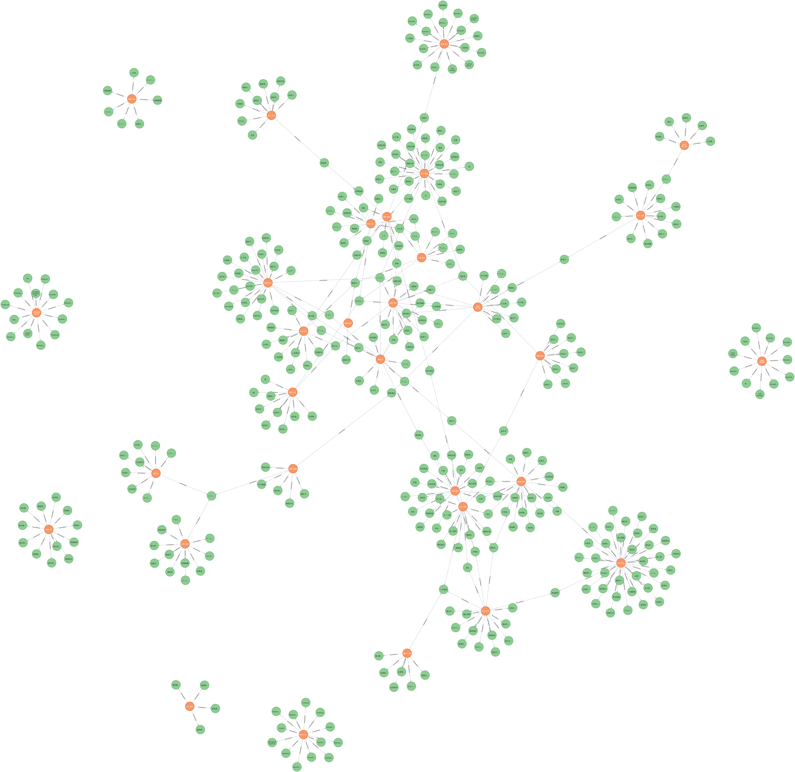

# GraphTMU

[Tokyo Metropolitan University][TMU] needs to do something about its shitty university systems.

## Overview

```cypher
MATCH (o:Organization{identifier: '東京都立大学_理学部_生命科学科'})--(p:Person)-[:knowsAbout]-(t)
RETURN p, t
```



```cypher
MATCH (o1:Organization{identifier: '東京都立大学_システムデザイン学部'})--(o2:Organization)--(p:Person)-[:knowsAbout]-(t)
RETURN o2, p, t
```


## Development

### 1. Scraper

```shell
$ cd server
$ poetry run poe scrape
```

### 2. Extractor

```shell
$ cd server/firebase
$ firebase emulators:start
```

```shell
$ cd server
$ poetry run poe extract
```

```shell
$ gcloud alpha firestore indexes composite create \
  --collection-group=keywords \
  --query-scope=COLLECTION \
  --field-config field-path=embedding,vector-config='{"dimension":"512", "flat": "{}"}'
```

### 3. Grapher

```shell
$ cd server
$ poetry run poe graph
```

### 4. Client

```shell
$ cd client
$ npm run dev
```

## Case Studies of Shitty System

Case studies of shitty system that do not make the best use of our tuition money.


[TMU]: https://www.tmu.ac.jp/
