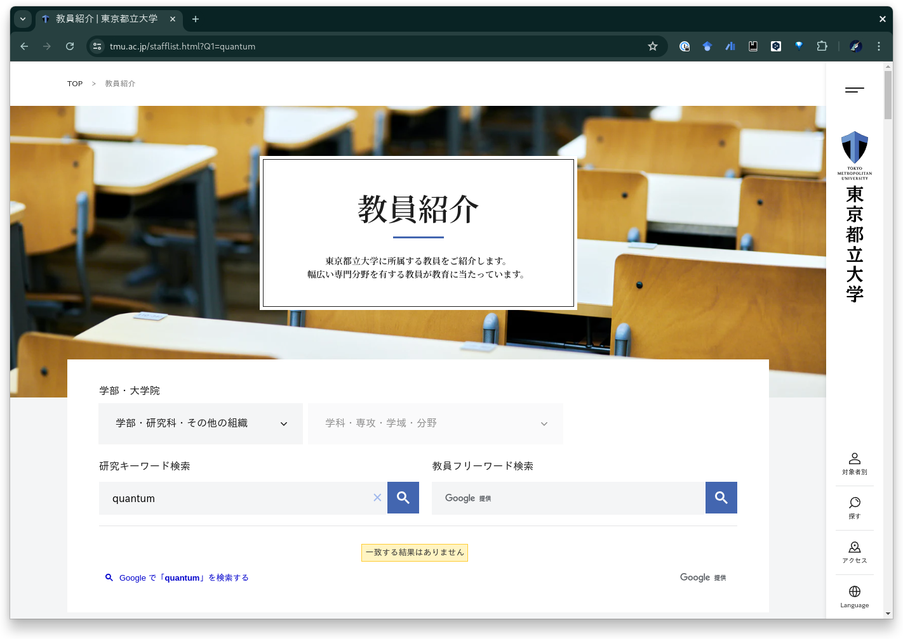
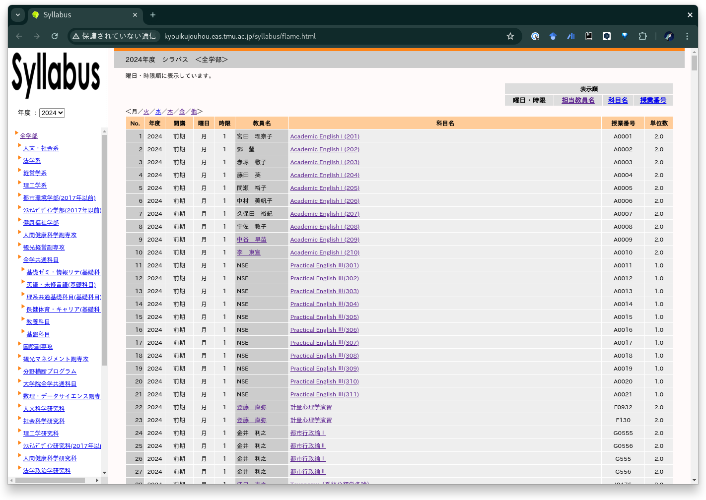

# GraphTMU

[Tokyo Metropolitan University][TMU] needs to do something about its [shitty syllabus search system][CampusSquare].

## Development

### 1. Scraper

```shell
$ cd server
$ poetry run poe scrape
```

### 2. Extractor

```shell
$ cd server/firebase
$ firebase emulators:start
```

```shell
$ cd server
$ poetry run poe extract
```

```shell
$ gcloud alpha firestore indexes composite create \
  --collection-group=keywords \
  --query-scope=COLLECTION \
  --field-config field-path=embedding,vector-config='{"dimension":"512", "flat": "{}"}'
```

### 3. Client

```shell
$ cd client
$ npm run dev
```

## Case Studies of Shitty System

Case studies of shitty system that do not make the best use of our tuition money.





[TMU]: https://www.tmu.ac.jp/
[CampusSquare]: https://www.nssol.nipponsteel.com/solution/popup/campussquare/index.html
